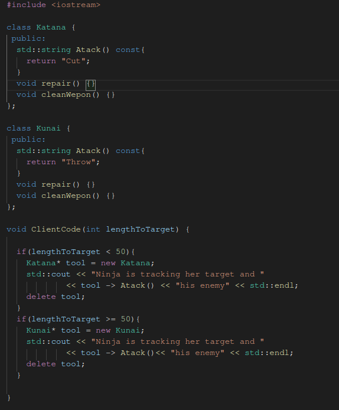
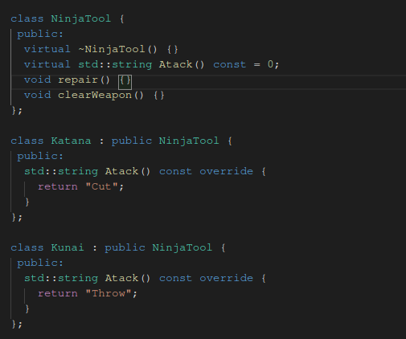
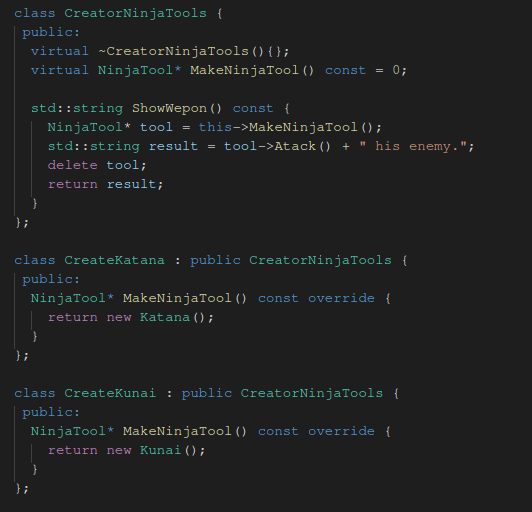
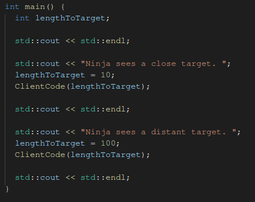

# Historyjka :)
Wyobraźmy sobie, że Ninja Jacek potrafi posługiwać się tylko kataną więc
większość jego umiejętności takich jak naprawa czy czyszczenie jest związana tylko
z tą jedną bronią. Jednak po pewnym czasie Jacek musi nauczyć się korzystania z
kunaia. Niby nic takiego, ale większość jego umiejętności związana jest z kataną,
więc nauka posługiwania się kunaiem wymaga ponownej nauki walki kataną, a zmiana
stylu walki była wyraźnie widoczna Bez sensu.

Więc Ninja Jacek udał się do swojego mentora po radę. Jego mentor powiedział my by
Nauczył się ogólnie czyścić i naprawiać swoją broń i aby nauka samej walki danym
narzędziem była innym elementem.

